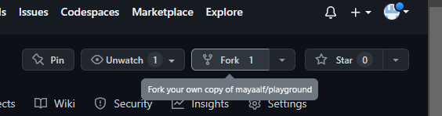
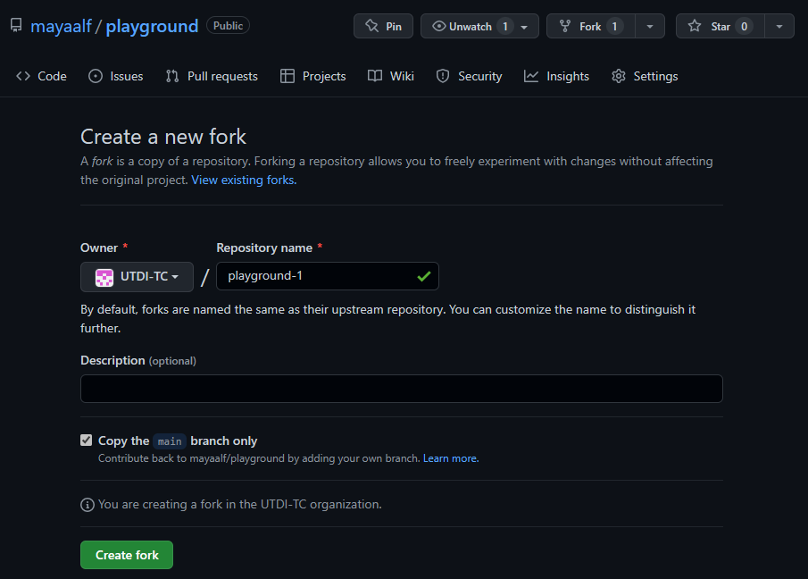
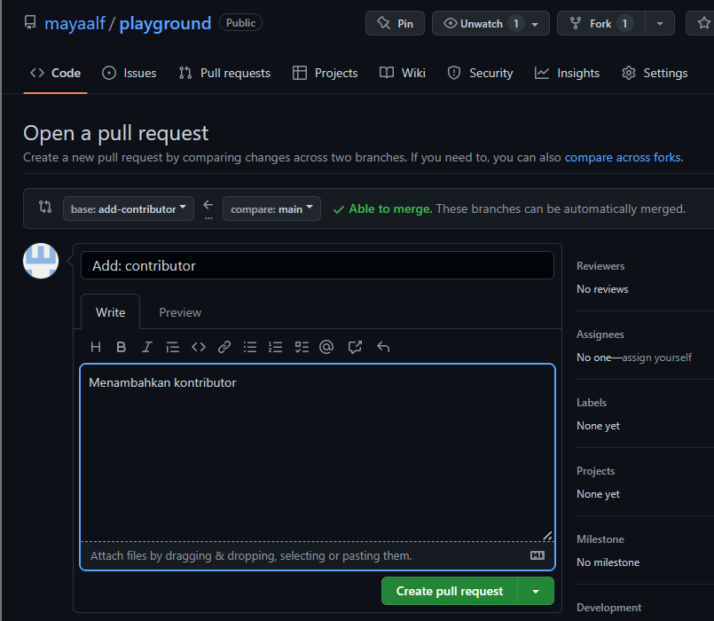

# Git untuk Kolaborasi

## Pendahuluan
Selain untuk mengelola aset digital milik diri sendiri, kita bisa menggunakan Git untuk berkolaborasi dalam suatu repo di GitHub yang bisa diakses bersama. Dalam kasus seperti ini, berarti ada 2 peran:

1. Pemilik repo, sering disebut sebagai upstream author.
2. Kontributor, yaitu orang-orang yang akan berkontribusi memberikan konten.

Untuk situasi seperti ini, diasumsikan:
1. Upstream author telah membuat repo git di GitHub
2. Kontributor telah mengetahui adanya repo tersebut, tertarik untuk berkontribusi, sudah mengetahui apa yang akan diberikan ke proyek (repo GitHub upstream author) tersebut.
3. Pembahasan selanjutnya adalah tentang bagaimana kontributor bisa mengirimkan kontribusi ke repo GitHub milik upstream author.

Dalam pembahasan ini:
1. Upstream author adalah oldstager.
2. Kontributor adalah bpdp
3. Repo dari upstream author adalah playground yang bisa diakses di https://github.com/mayaalf/playground

## Fork
Fork adalah membuat clone dari suatu repo di GitHub milik upstream author, diletakkan ke milik kontributor. Fork hanya dilakukan sekali saja. Pada dasarnya, proses untuk fork ini meliputi:

1. Fork repo di web GitHub.
2. Clone fork tersebut di komputer lokal.
Kontributor harus mem-fork repo upstream author sehingga di repo kontributor muncul repo tersebut. Proses forking ini dijelaskan dengan langkah-langkah berikut:

1. Login ke GitHub
2. Akses repo yang akan di-fork: https://github.com/mayaalf/playground
3. Pada sisi kanan atas, klik Fork:



4. Pilih akan ditempatkan di accound mana



5. Setelah proses, repo dari *upstream author* sudah berada di account GitHub (kontributor) 


Setelah proses tersebut, clone di komputer lokal


Repo ```origin``` sudah dituliskan konfigurasinya pada saat melakukan proses clone dari repo kontributor. Konfigurasi repo *upstream* harus dibuat dan kemudian menambahkan remote upstream


## Mengirimkan Pull Request
Langkah-langkahnya adalah sebagai berikut:
1. Kontributor akan bekerja di repo lokal (create, update, delete isi)
2. Commit
3. Push ke repo kontributor
4. Kirimkan PR ke repo upstream author.
5. Upstream author me-review dan kemudian menyetujui (merge) ke master atau menolak PR.
6. Jika disetujui dan di-merge ke repo master dari upstream author, sinkronkan repo di komputer lokal dan repo GitHub  kontributor.

Berikut ini adalah contoh pengiriman perubahan isi README.md dengan menambahkan kontributor.

## Membuat Perubahan di Repo Lokal
Sebelum melakukan perubahan, pastikan:

1. Sudah ada koordinasi secara manual tentang perubahan-perubahan yang akan dilakukan.
2. Setelah melakukan perubahan-perubahan, pastikan bahwa isi repo lokal tersinkronisasi dengan repo dari upstream author.
3. Cara melakukan sinkronisasi:


4. Lakukan perubahan-perubahan, setelah itu push ke **origin** (milik kontributor)


5. Setelah itu buka halaman Web repo kontributor https://github.com/UTDI-TC/playground-1. Pada halaman tersebut akan ditampilkan isi yang di-push


6. Pilih ```compare and pull request```, kemudian isikan PR dan klik ```Create pull request```.



7. Pada repo upstream author, muncul angka 1 (artinya jumlahnya 1) pada ```Pull requests``` di bagian atas.
8. *Upstream author* bisa menyetujui setelah melakukan review: klik pada ```Pull requests```, akan muncul PR dengan message seperti yang ditulis oleh kontributor (Add: contributor). Klik pada PR tersebut, review kemudian klik ```Merge pull request``` diikuti dengan ```Confirm merge```. Setelah itu, status akan berubah menjadi ```Merged```.


9. Sinkronkan semua repo (lokal maupun GitHub kontributor)


