# Installasi Git Windows

[ [<< Kembali](README.md) ]

1. Double click pada file download Git kemudian klik **Next** untuk melanjutkan installasi.

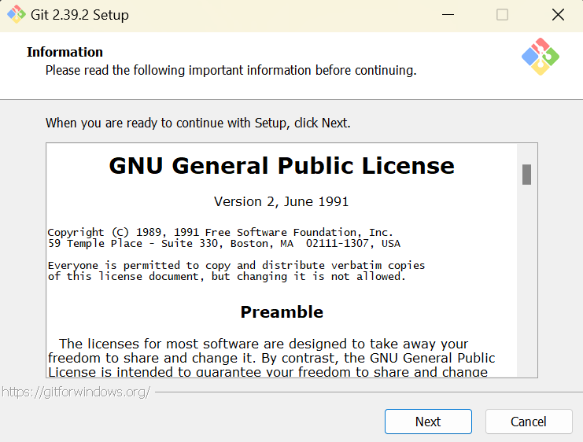

2. Setelah itu pilih lokasi instalasi. Secara default akan terisi _C:\Program Files\Git_. Gantilah lokasi jika menginginkannya.

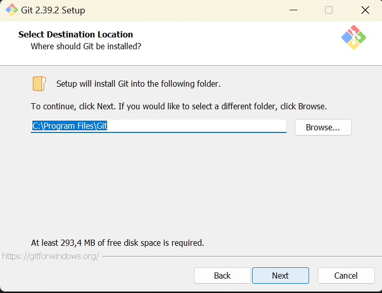

3. Pilih komponen. Tidak perlu diubah-ubah, sesuaikan dengan default saja lalu klik **Next**.

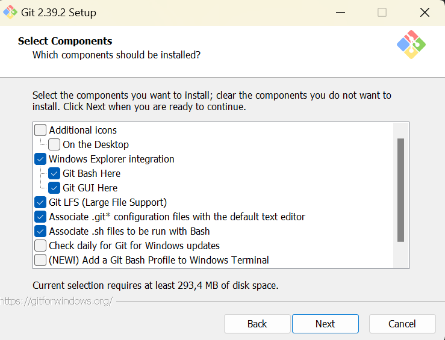

4. Mengisi shortcut untuk menu start. Gunakan default **(Git)**, ganti jika ingin mengganti -misalnya Git VCS

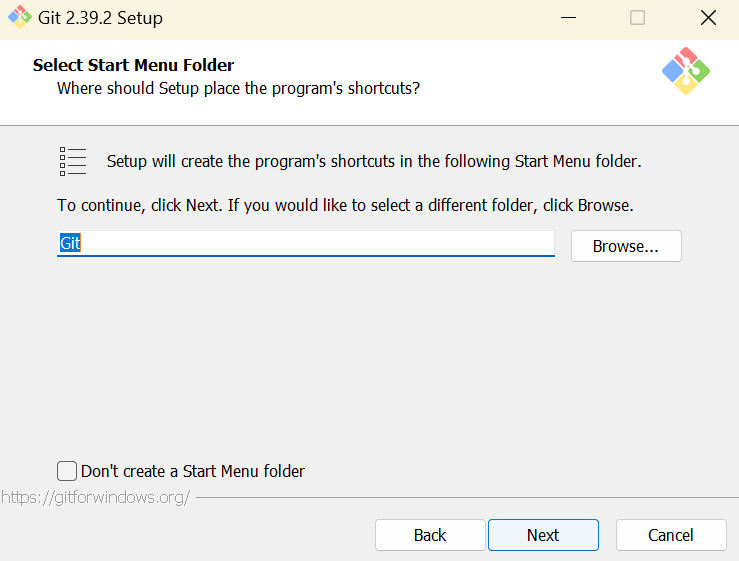

5. Pilih edior yang akan digunakan bersama dengan Git. Pada pilihan ini, digunakan Visual Studio Code.

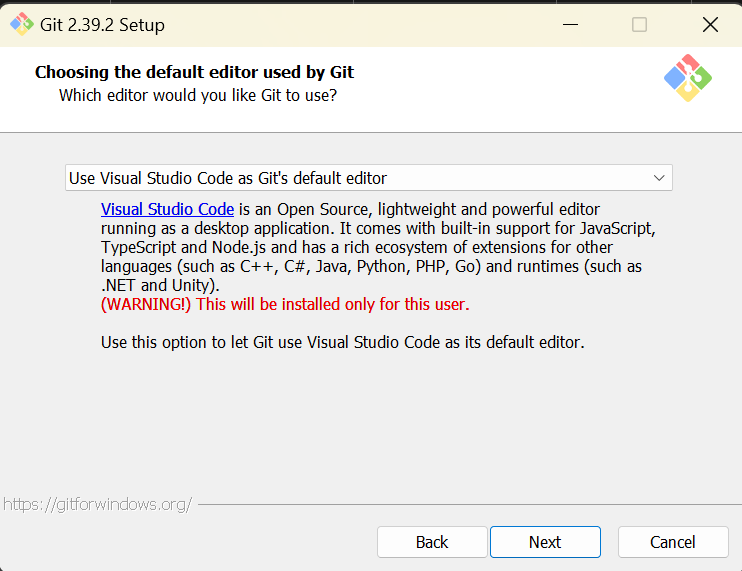

6. Pada saat installasi, Git menyediakan akses git melalui Bash maupun commad prompt. Pilih pilihan kedua supaya bisa menggunakan dua antarmuka.

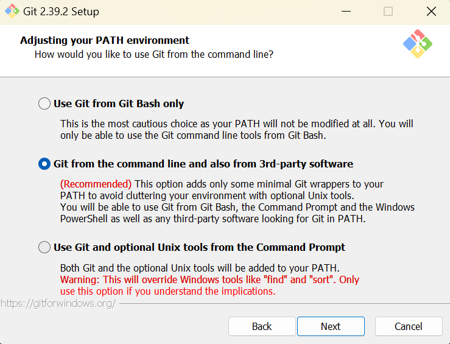

7. Pilih OpenSSL untuk HTTPS. Git menggunakan https untuk akses ke repo GitHub atau repo-repo lain.

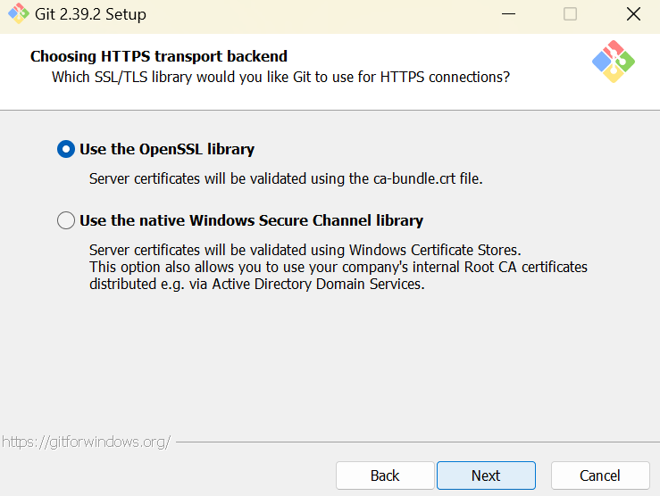

8.Pilih pilihan pertama untuk konversi akhir baris (CR-LF).

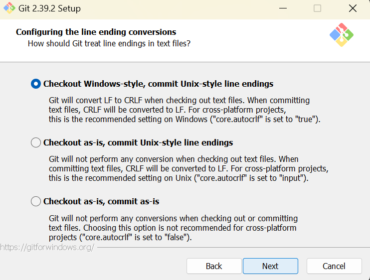

9. Pilih PuTTY untuk terminal yang digunakan untuk mengakses GitBash.

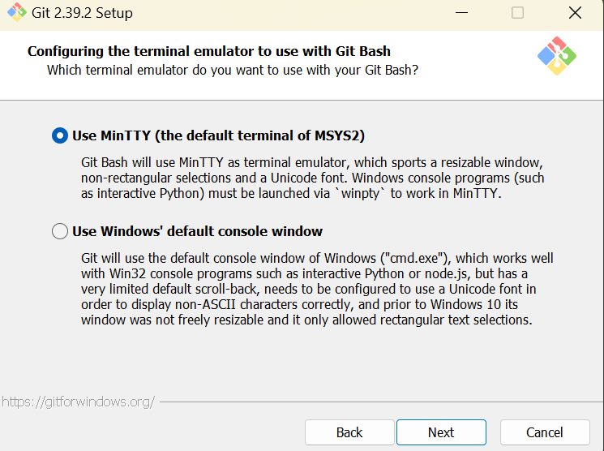

10. Opsi ekstra, pilih enable file system caching.

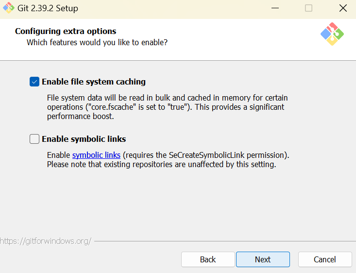

11. Setelah itu proses installasi akan dilakukan.

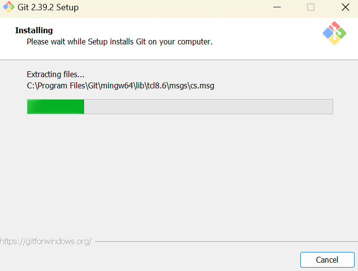

12. Jika sudah selesai akan muncul dialog pemberitahun lalu kilik **Finish**.

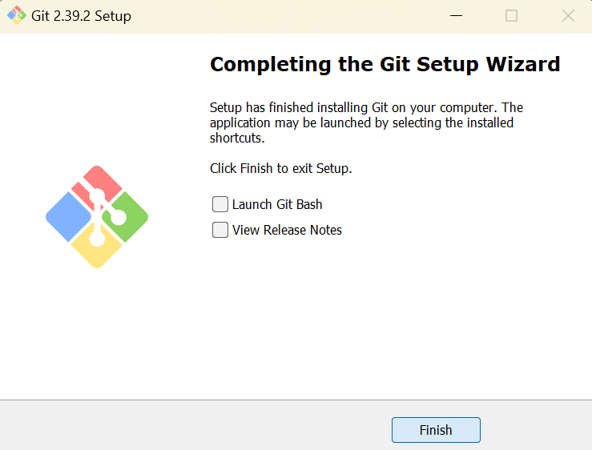

13. Menjalankan Git dari menu start ketikkan "Git", lalu akan muncul pilihan "Git Bash", "Git CMD" atau "Git GUI"


14. Tampilan jika menggunakan "Git Bash"

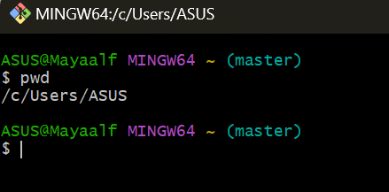

15. Tampilan jika menggunkan "Git GUI"

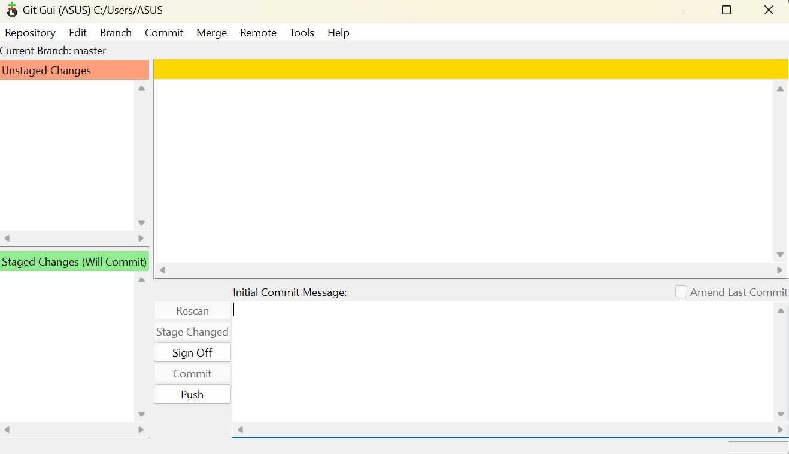

16. Mencoba dari command prompt lalu eksekusi "git --version" untuk melihat sudah berhasil terinstall atau belum. Jika sudah terinstall dengan benar maka akan muncul seperti ini :

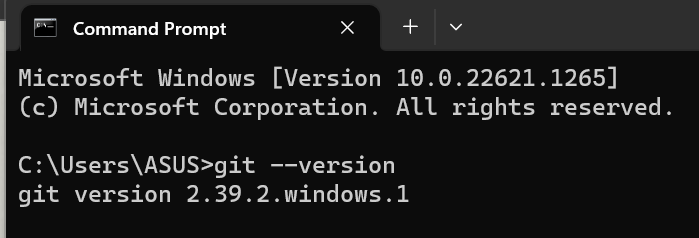


# Konfigurasi Git

Konfigurasi menggunakan username dan email dengan perintah berikut :

```
$ git config --global user.name "Nama Anda di GutHub"
$ git config --global user.email email@domain.tld
```

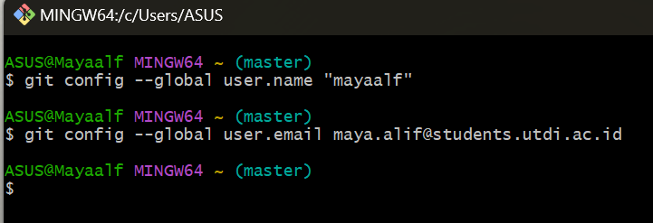

Isian diatas harus sesuai dengan email yang digunakan untuk mendaftar GitHub. Untuk melihat konfigurasi yang sudah ada :

```
$ git config --list
user.name=mayaalf
user.email=maya.alif@students.utdi.ac.id
$
```

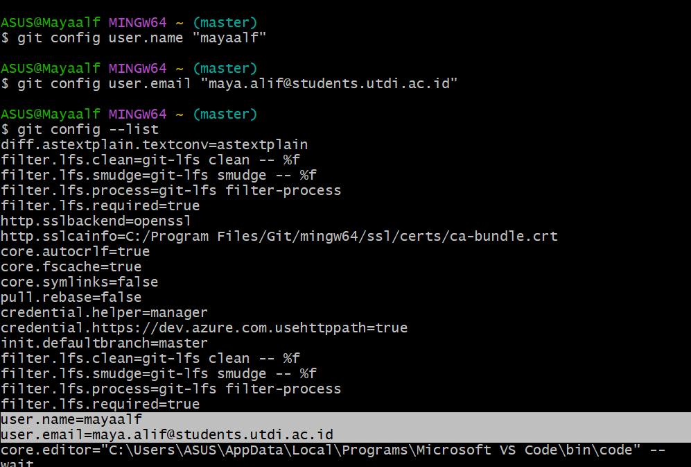

Langkah ini cukup dilakukan sekali saja, kecuali jika ingin melakukan perubahan nama dan email.


# Mengelola Repo Sendiri

## Mengelola Repo Sendiri di Account Sendiri

### Langkah-langkah

1. Buat repo kosong di GitHub, bisa public maupun private
2. Clone repo kosong tersebut di komputer lokal
3. Perintah berikutnya terkait dengan perubahan repo serta sinkronisasi antara GitHub dengan lokal.

# Membuat Repo

1. Klik tanda + pada bagian atas setelah login, pilih **New repository**

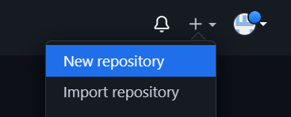

2. Isikan nama, keterangan serta lisensi. Jika dikehendaki bisa membuat repo **Private**

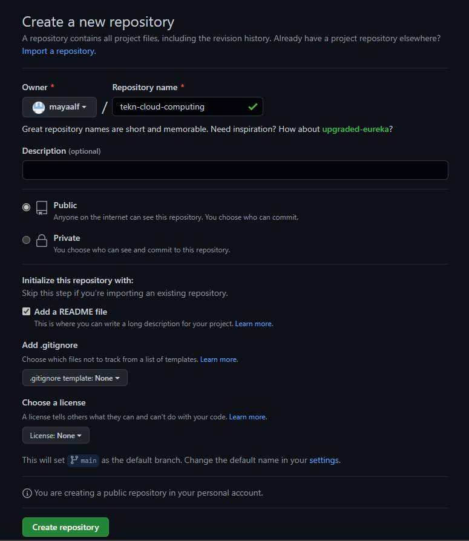

3. Klik ```Create Repository```

Setelah langkah-langkah tersebut repo akan dibuat dan bisa diakses menggunakan pola ```https://github.com/username/reponame```. Pada repo tersebut, hanya akan muncul 1 file, yaitu LICENSE. Jika memilih membuat README pada saat langkah ke 2, juga akan muncul README.md. Ada atau tidak ada README.md tidak mempunyai efek apapun pada langkah ini.

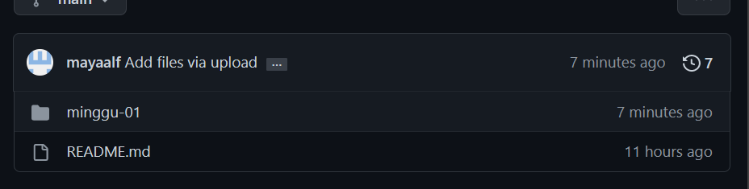

### Clone Repo
Proses ```clone``` untuk duplikasi remote repo di GitHub ke komputer lokal, perintah yang digunakan :
```
git clone https://github.com/mayaalf/tekn-cloud-computing
Cloning into 'tekn-cloud-computing'...
remote: Enumerating objects: 3, done.
remote: Counting objects: 100% (3/3), done.
remote: Compressing objects: 100% (2/2), done.
remote: Total 3 (delta 0), reused 0 (delta 0), pack-reused 0
Unpacking objects: 100% (3/3), done.
```

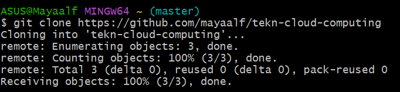

Setelah perintah ini, di direktori ```tekn-cloud-computing``` akan disimpan isi repo yang sama dengan di GitHub. Perbedaannya, di komputer lokal terdapat direktori ```.git``` yang digunakan secara internal oleh Git.


## Mengelola Repo

### Mengubah Isi - Push Tanpa Branching dan Merging

Perubahan isi bisa terjadi karena satu atau kombinasi beberapa hal berikut:

1. File dihapus
2. File diedit
3. Membuat file / direktori baru
4. Menghapus direktori

Setelah melakukan satu atau beberapa hal diatas, lakukan push ke Repo GitHub. Contohnya sebagai berikut:

1. Buat file baru bernama README dengan ekstensi .md pada direktori Repo, lalu isikan "Test".

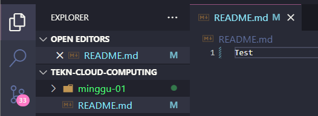

2. Setelah itu lakukan sinkronisasi dengan menggunakan _push to_ atau _sync_.

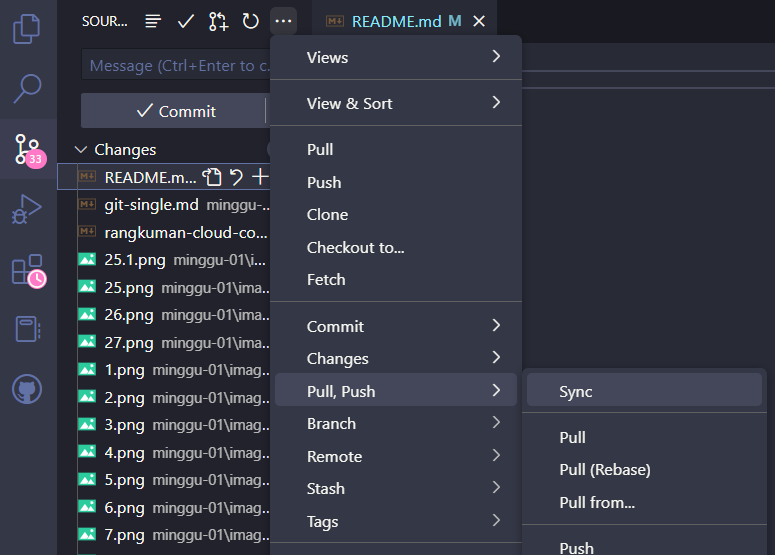

### Mengubah Isi dengan Branching dan Merging

1. Buat cabang baru untuk menampung perubahan pada *Source Control* lalu **Create Branch** (more action > Branch) dan berikan nama cabang, saya memberi nama cabang tersebut "edit-readme-1".

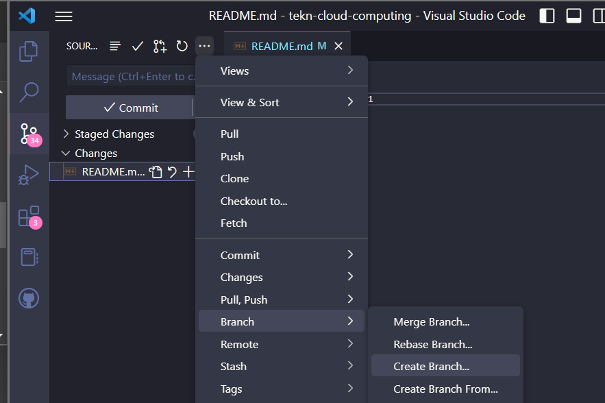

2. Lakukan perubahan pada cabang "edit-readme-1", misalnya saya tambahkan sesuatu dalam file README lalu saya save filenya. Dapat dilihat pada file README terdapat logo M, artinya Modified atau terjadi perubahan pada file.

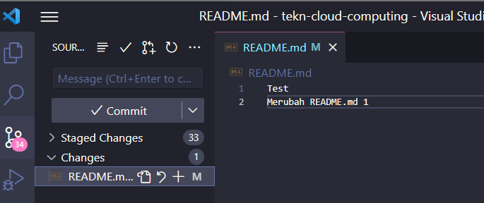

3. Setelah itu perubahannya akan kita commit dengan cara klik **Stage Changes** atau tombol +, lalu commit dengan klik tombol checklist dan berikan comment mengenai commit yang telah dilakukan.

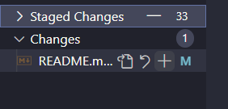

4. Gunakan Publish Branch untuk meng-upload hasil perubahan yang dilakukan pada cabang baru tadi, di contoh ini nama cabang barunya adalah cabang "edit-readme-1".

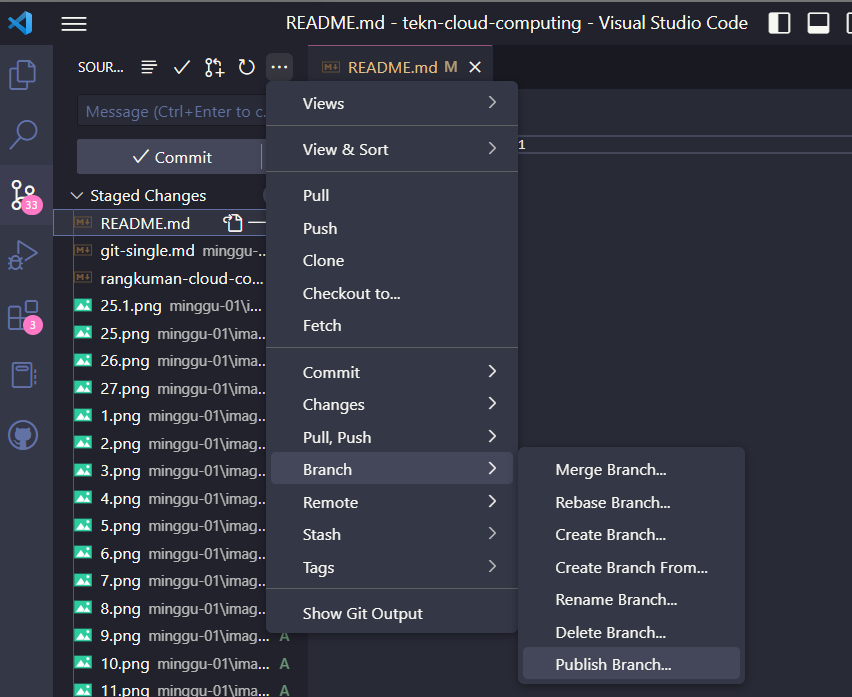

5. Buatlah **Pull Request** pada GitHub, dengan cara klik **Compare & pull request**.
6. Setelah itu klik **Create pull request**, dan lakukan *merge* dengan **Merge Pull Request**.

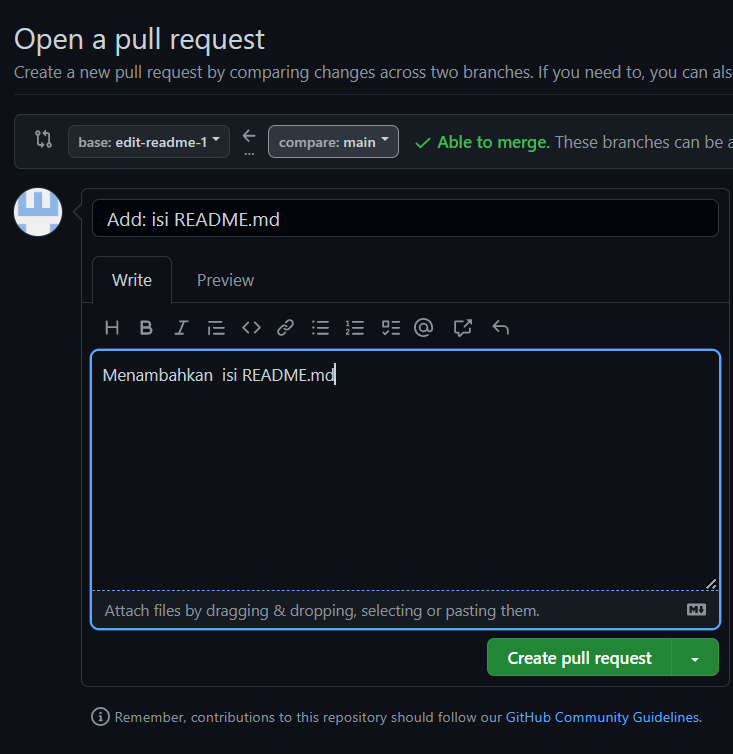
Setelah membuat PR, PR tersebut bisa di-merge :
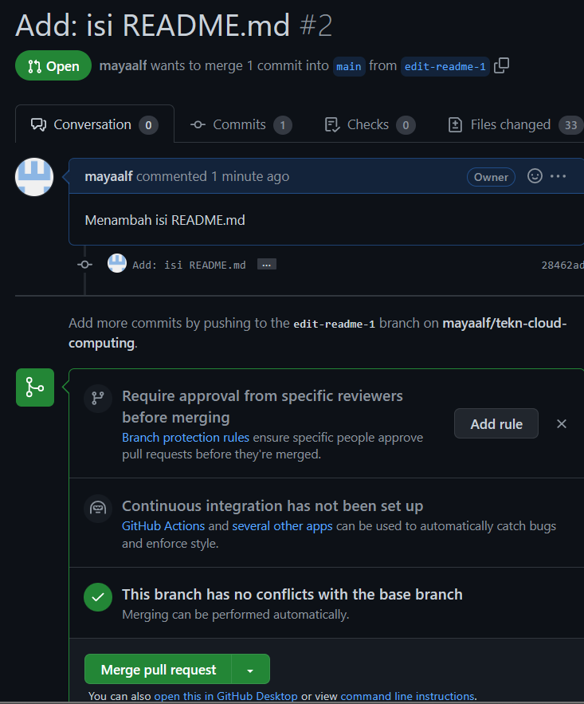


### Sinkronisasi
Suatu saat, bisa saja terjadi kita menggunakan komputer lain dan mengedit repo melalui repo lokal di komputer lain, setelah itu pindah ke kamputer lain lagi. Saat itu, kita perlu melakukan sinkronisasi ke kemputer lokal. Perintah untuk sinkronisasi adalah:
```
$ git pull
```

### Membatalkan Perubahan

```
$ git checkout -b edit-readme-2
Switched to a new branch 'edit-readme-2'
$ vim README.md
$ cat README.md
# My Awesome Project

Ini isi proyek. Jadi agak kacau nih
$ git checkout master
M	README.md
Switched to branch 'master'
Your branch is up to date with 'origin/master'.
$ cat README.md
# My Awesome Project

Ini isi proyek. Jadi agak kacau nih
$ git branch -D edit-readme-2
Deleted branch edit-readme-2 (was 7e546b0).
$ git branch
* master
$ cat README.md
# My Awesome Project

Ini isi proyek. Jadi agak kacau nih
$ git reset --hard
HEAD is now at 7e546b0 Merge pull request #1 from oldstager/edit-readme-1
$ cat README.md
# My Awesome Project

Ini isi proyek
$
```

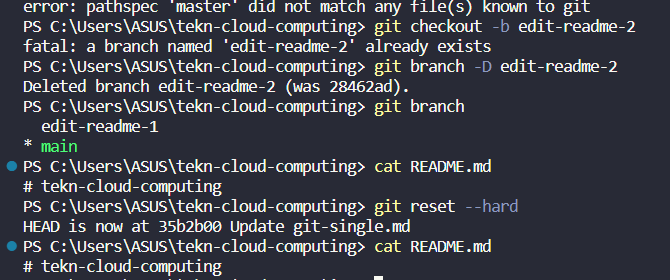

### Undo Commit Terakhir

Suatu saat, mungkin kita sudah terlanjur mem-push perubahan ke repo GitHub, setelah itu kita baru menyadari bahwa perubahan tersebut salah. Untuk itu, kita bisa melakukan ```git revert```.

```
$ cat README.md
# My Awesome Project

Ini isi proyek
$ git log --oneline
7e546b0 (HEAD -> master, origin/master, origin/HEAD) Merge pull request #1 from oldstager/edit-readme-1
032d079 (origin/edit-readme-1) Add: isi README.md
2ab2e28 Add: README.md
8dd68d4 Initial commit
$ vim README.md
$ git add -A
$ git commit -m "Add: contents"
[master c55fd06] Add: contents
 1 file changed, 4 insertions(+), 1 deletion(-)
$ git push origin master 
Username for 'https://github.com': oldstager
Password for 'https://oldstager@github.com': 
Enumerating objects: 5, done.
Counting objects: 100% (5/5), done.
Delta compression using up to 8 threads
Compressing objects: 100% (3/3), done.
Writing objects: 100% (3/3), 335 bytes | 335.00 KiB/s, done.
Total 3 (delta 0), reused 0 (delta 0)
To https://github.com/oldstager/awesome-project
   7e546b0..c55fd06  master -> master
$ vim README.md
$  git add -A
$  git commit -m "Add: contents - 2"
[master fed7e79] Add: contents - 2
 1 file changed, 1 insertion(+)
$ git push origin master
Username for 'https://github.com': oldstager
Password for 'https://oldstager@github.com': 
Enumerating objects: 5, done.
Counting objects: 100% (5/5), done.
Delta compression using up to 8 threads
Compressing objects: 100% (3/3), done.
Writing objects: 100% (3/3), 338 bytes | 338.00 KiB/s, done.
Total 3 (delta 0), reused 0 (delta 0)
To https://github.com/oldstager/awesome-project
   c55fd06..fed7e79  master -> master
$ cat README.md
# My Awesome Project

Ini isi proyeka

Ini isi 1

Ini isi 2
$ git status
On branch master
Your branch is up to date with 'origin/master'.

nothing to commit, working tree clean
$
```

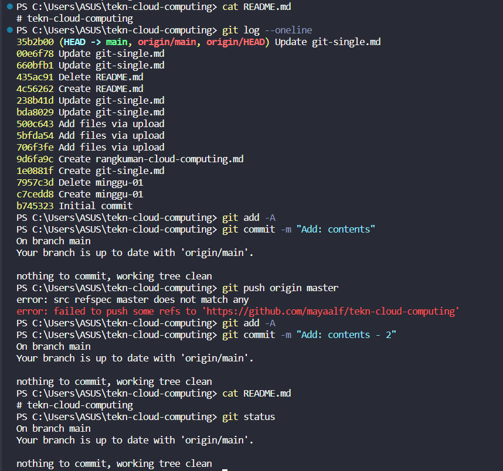

*push* ke repo GitHub

```

$ git status
On branch master
Your branch is ahead of 'origin/master' by 1 commit.
  (use "git push" to publish your local commits)

nothing to commit, working tree clean
$ git push origin master
Username for 'https://github.com': oldstager
Password for 'https://oldstager@github.com': 
Enumerating objects: 5, done.
Counting objects: 100% (5/5), done.
Delta compression using up to 8 threads
Compressing objects: 100% (3/3), done.
Writing objects: 100% (3/3), 347 bytes | 347.00 KiB/s, done.
Total 3 (delta 1), reused 0 (delta 0)
remote: Resolving deltas: 100% (1/1), completed with 1 local object.
To https://github.com/oldstager/awesome-project
   fed7e79..f800ced  master -> master
$ cat README.md
# My Awesome Project

Ini isi proyeka

Ini isi 1

$
```
Untuk kembali ke perubahan pada saat yang sudah lama, yang perlu dilakukan adalah melakukan ```git revert <posisi>``` kemudian mengedit secara manual kemudian push ke repo.

```
$ cat README.md
# My Awesome Project

Ini isi proyeka

Ini isi 1

Ini isi 2

Ini isi 3
$ git log --oneline
b14810f (HEAD -> master, origin/master, origin/HEAD) Add: isi 3
a7615fb Add: isi 2
f800ced Revert "Add: contents - 2"
fed7e79 Add: contents - 2
c55fd06 Add: contents
7e546b0 Merge pull request #1 from oldstager/edit-readme-1
032d079 (origin/edit-readme-1) Add: isi README.md
2ab2e28 Add: README.md
8dd68d4 Initial commit
$ git revert a7615fb
error: could not revert a7615fb... Add: isi 2
hint: after resolving the conflicts, mark the corrected paths
hint: with 'git add <paths>' or 'git rm <paths>'
hint: and commit the result with 'git commit'
$
```

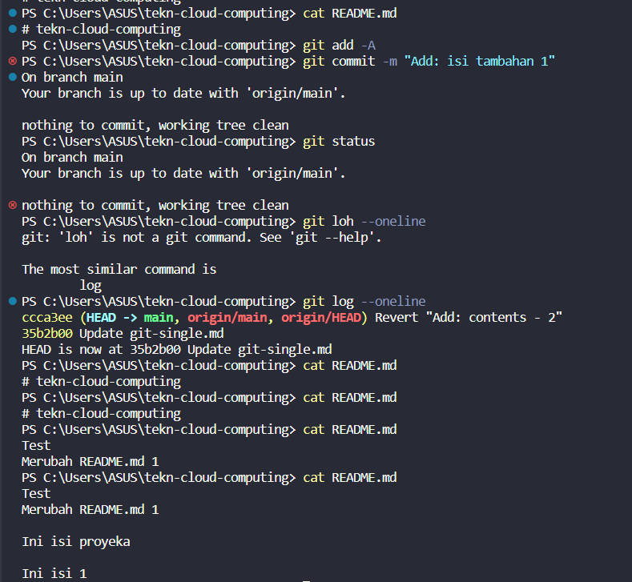

Setelah itu, lanjutkan proses revert. Saat ```git revert --continue``` isikan pesan revert.

```
$ git add README.md
$ git status
On branch master
Your branch is up to date with 'origin/master'.

You are currently reverting commit a7615fb.
  (all conflicts fixed: run "git revert --continue")
  (use "git revert --abort" to cancel the revert operation)

Changes to be committed:
  (use "git reset HEAD <file>..." to unstage)

	modified:   README.md

$ git revert --continue
[master dec93e1] Revert "Add: isi 2"
 1 file changed, 3 insertions(+), 3 deletions(-)
$ git status
On branch master
Your branch is ahead of 'origin/master' by 1 commit.
  (use "git push" to publish your local commits)

nothing to commit, working tree clean
$ git push origin master
Username for 'https://github.com': oldstager
Password for 'https://oldstager@github.com': 
Enumerating objects: 5, done.
Counting objects: 100% (5/5), done.
Delta compression using up to 8 threads
Compressing objects: 100% (3/3), done.
Writing objects: 100% (3/3), 401 bytes | 401.00 KiB/s, done.
Total 3 (delta 0), reused 0 (delta 0)
To https://github.com/oldstager/awesome-project
   b14810f..dec93e1  master -> master
$
```

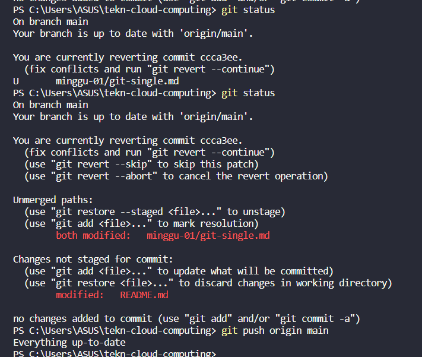


## Mengelola Repo Sendiri di Organisasi

Repo yang dibuat bisa diletakkan pada account kita maupun berada pada suatu organisasi. Organisasi bisa kita buat sendiri maupun kita dimasukkan menjadi anggota organisasi. Pada dasarnya, bagian ini sama dengan bagian sebelumnya, hanya saja, pada saat membuat repo Owner dari repo adalah organisasi seperti berikut ini:

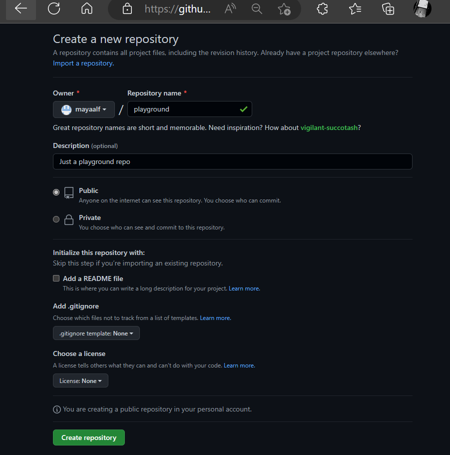


### Membuat repository dengan command line

```
echo "# playground" >> README.md
git init
git add README.md
git commit -m "first commit"
git branch -M main
git remote add origin https://github.com/UTDI-TC/playground.git
git push -u origin main
```

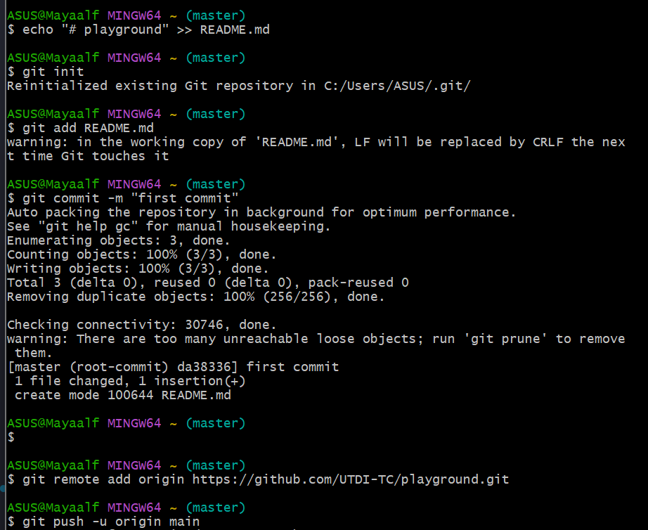

### Push repository dari command line

```
git remote add origin https://github.com/UTDI-TC/playground.git
git branch -M main
git push -u origin main
```

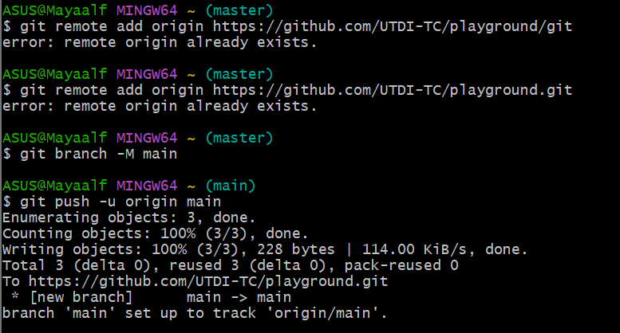

### Clone

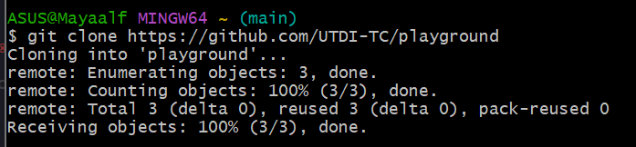
