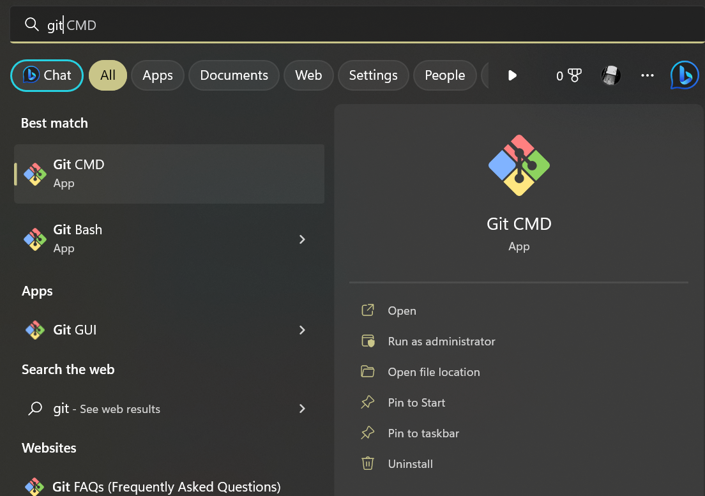

# Installasi Git Windows

1. Double click pada file download Git kemudian klik **Next** untuk melanjutkan installasi.


2. Setelah itu pilih lokasi instalasi. Secara default akan terisi _C:\Program Files\Git_. Gantilah lokasi jika menginginkannya.


3. Pilih komponen. Tidak perlu diubah-ubah, sesuaikan dengan default saja lalu klik **Next**.


4. Mengisi shortcut untuk menu start. Gunakan default **(Git)**, ganti jika ingin mengganti -misalnya Git VCS


5. Pilih edior yang akan digunakan bersama dengan Git. Pada pilihan ini, digunakan Visual Studio Code.


6. Pada saat installasi, Git menyediakan akses git melalui Bash maupun commad prompt. Pilih pilihan kedua supaya bisa menggunakan dua antarmuka.


7. Pilih OpenSSL untuk HTTPS. Git menggunakan https untuk akses ke repo GitHub atau repo-repo lain.


8.Pilih pilihan pertama untuk konversi akhir baris (CR-LF).


9. Pilih PuTTY untuk terminal yang digunakan untuk mengakses GitBash.


10. Opsi ekstra, pilih enable file system caching.


11. Setelah itu proses installasi akan dilakukan.


12. Jika sudah selesai akan muncul dialog pemberitahun lalu kilik **Finish**.


13. Menjalankan Git dari menu start ketikkan "Git", lalu akan muncul pilihan "Git Bash", "Git CMD" atau "Git GUI"



14. Tampilan jika menggunakan "Git Bash"


15. Tampilan jika menggunkan "Git GUI"


16. Mencoba dari command prompt lalu eksekusi "git --version" untuk melihat sudah berhasil terinstall atau belum. Jika sudah terinstall dengan benar maka akan muncul seperti ini :


# Konfigurasi Git

Konfigurasi menggunakan username dan email dengan perintah berikut :

```
$ git config --global user.name "Nama Anda di GutHub"
$ git config --global user.email email@domain.tld
```


Isian diatas harus sesuai dengan email yang digunakan untuk mendaftar GitHub. Untuk melihat konfigurasi yang sudah ada :

```
$ git config --list
user.name=mayaalf
user.email=maya.alif@students.utdi.ac.id
$
```


Langkah ini cukup dilakukan sekali saja, kecuali jika ingin melakukan perubahan nama dan email.


# Mengelola Repo Sendiri

## Mengelola Repo Sendiri di Account Sendiri

### Langkah-langkah

1. Buat repo kosong di GitHub, bisa public maupun private
2. Clone repo kosong tersebut di komputer lokal
3. Perintah berikutnya terkait dengan perubahan repo serta sinkronisasi antara GitHub dengan lokal.

### Membuat Repo

1. Klik tanda + pada bagian atas setelah login, pilih **New repository**


2. Isikan nama, keterangan serta lisensi. Jika dikehendaki bisa membuat repo **Private**


3. Klik ```Create Repository```

Setelah langkah-langkah tersebut repo akan dibuat dan bisa diakses menggunakan pola ```https://github.com/username/reponame```. Pada repo tersebut, hanya akan muncul 1 file, yaitu LICENSE. Jika memilih membuat README pada saat langkah ke 2, juga akan muncul README.md. Ada atau tidak ada README.md tidak mempunyai efek apapun pada langkah ini.


###Clone Repo
Proses ```clone``` untuk duplikasi remote repo di GitHub ke komputer lokal, perintah yang digunakan :
```
git clone https://github.com/mayaalf/tekn-cloud-computing
Cloning into 'tekn-cloud-computing'...
remote: Enumerating objects: 3, done.
remote: Counting objects: 100% (3/3), done.
remote: Compressing objects: 100% (2/2), done.
remote: Total 3 (delta 0), reused 0 (delta 0), pack-reused 0
Unpacking objects: 100% (3/3), done.
```


Setelah perintah ini, di direktori ```tekn-cloud-computing``` akan disimpan isi repo yang sama dengan di GitHub. Perbedaannya, di komputer lokal terdapat direktori ```.git``` yang digunakan secara internal oleh Git.


### Mengelola Repo

### Mengubah Isi - Push Tanpa Branching dan Merging

Perubahan isi bisa terjadi karena satu atau kombinasi beberapa hal berikut:

1. File dihapus
2. File diedit
3. Membuat file / direktori baru
4. Menghapus direktori

Setelah melakukan satu atau beberapa hal diatas, lakukan push ke Repo GitHub. Contohnya sebagai berikut:

1. Buat file baru bernama README dengan ekstensi .md pada direktori Repo, lalu isikan "Test".


2. Setelah itu lakukan sinkronisasi dengan menggunakan _push to_ atau _sync_.


### Mengubah Isi dengan Branching dan Merging

1. Buat cabang baru untuk menampung perubahan pada *Source Control* lalu **Create Branch** (more action > Branch) dan berikan nama cabang, saya memberi nama cabang tersebut "edit-readme-1".


2. Lakukan perubahan pada cabang "edit-readme-1", misalnya saya tambahkan sesuatu dalam file README lalu saya save filenya. Dapat dilihat pada file README terdapat logo M, artinya Modified atau terjadi perubahan pada file.


3. Setelah itu perubahannya akan kita commit dengan cara klik **Stage Changes** atau tombol +, lalu commit dengan klik tombol checklist dan berikan comment mengenai commit yang telah dilakukan.


4. Gunakan Publish Branch untuk meng-upload hasil perubahan yang dilakukan pada cabang baru tadi, di contoh ini nama cabang barunya adalah cabang "edit-readme-1".


5. Buatlah **Pull Request** pada GitHub, dengan cara klik **Compare & pull request**.


